<div align="center">

  <a href="github.com/Sebastian1401/Proyecto-de-grado-mejorado">
    
  </a>

  <br/>

  <h1>NeuroDermaScan – Detección de lesiones cutáneas en Orange Pi 5</h1>

  <p>
    <strong>Una solución de IA en el borde para el análisis de lesiones cutáneas en tiempo real, potenciada por la NPU RK3588.</strong>
  </p>

  <p>
    
    
    
    
    
  </p>

</div>

## <div align="center">🎯 Objetivo</div>

Ofrecer un flujo completo “de laboratorio a clínica” que combine **desempeño en el borde (edge)**, **baja latencia** y **trazabilidad por paciente**, manteniendo los datos **en el dispositivo**.

## <div align="center">✨ Destacados</div>

-   🚀 **Inferencia acelerada por NPU:** Utiliza el máximo potencial del chip RK3588 para análisis en tiempo real.
-   🎥 **Streaming MJPEG estable:** Visualización en vivo fluida.
-   📂 **Gestión de pacientes:** Guarda y organiza capturas por cédula en la carpeta `var/patients/`.
-   🖥️ **UI optimizada:** Interfaz web simple con galería, descarga de datos y un historial para acceder a resultados anteriores.

## <div align="center">🛠️ Pila Técnica (Tech Stack)</div>

-   **Backend:** Python 3, Flask, Gunicorn (con gevent).
-   **Procesamiento de IA:** RKNN Toolkit / Adapter RKNN.
-   **Procesamiento de video:** OpenCV.
-   **Frontend:** HTML, CSS, JavaScript (con jQuery para peticiones AJAX).
-   **Hardware y SO:** Orange Pi 5 (Ubuntu/Debian-based) con drivers NPU.


## 🏗️ Arquitectura y Flujo de Trabajo

El sistema opera de manera local en la Orange Pi 5, siguiendo un flujo de datos claro y eficiente desde la captura hasta la visualización y el almacenamiento.

```mermaid
graph TD
    subgraph "Hardware Central: Orange Pi 5"
        A[🔬 Microscopio USB] -- Flujo de video (RAW) --> B{Backend Flask};
        B -- Envía frame a NPU --> C[🧠 Inferencia en tiempo real con RKNN];
        C -- Devuelve resultados --> B;
        B -- Guarda capturas + datos --> D[📁 Almacenamiento Local<br>/var/patients/];
    end

    subgraph "Cliente/Usuario"
       E[📱/💻 Navegador Web]
    end

    B -- Streaming MJPEG con inferencias --> E;
    E -- Envía comandos (capturar, etc.) --> B;

    style A fill:#f9f,stroke:#333,stroke-width:2px
    style E fill:#cde4f7,stroke:#333,stroke-width:2px
```


---

## ⚙️ Guía de Flasheo: Preparando el Sistema Operativo

Esta guía cubre los pasos esenciales para instalar el sistema operativo en la Orange Pi 5. **Este proceso se realiza en tu computador personal**, no en la Orange Pi.

### 1. Prerrequisitos

Antes de comenzar, asegúrate de tener lo siguiente:

* 💾 **Tarjeta MicroSD:** Mínimo 32 GB, **Clase 10** es obligatorio para un rendimiento adecuado.
* 🖥️ **Computador personal:** Con un lector de tarjetas MicroSD o en su defecto usando un adaptador.
* ⚡ **Software de flasheo:** Una herramienta para escribir imágenes de SO. Se recomiendan:
    * [**balenaEtcher**](https://www.balena.io/etcher/) (multiplataforma y muy fácil de usar).
    * [**Rufus**](https://rufus.ie/) (solo Windows).
    * [**USBImager**](https://gitlab.com/bztsrc/usbimager) (ligero y multiplataforma).

### 2. Descarga de la Imagen del Sistema Operativo

El corazón del proyecto es la capacidad de usar la NPU (Unidad de Procesamiento Neuronal). Por ello, es crucial seleccionar una imagen de sistema operativo que incluya los drivers necesarios.

1.  **Ve a la página oficial de descargas de Orange Pi 5:**
    * [**Orange Pi 5 - Software Resources**](http://www.orangepi.org/html/hardWare/computerAndMicrocontrollers/service-and-support/Orange-pi-5.html)

2.  **Selecciona la imagen recomendada:** Para este proyecto, se ha verificado el funcionamiento con la siguiente versión:
    * [**Armbian 25.8.2 Bookworm Minimal / IOT**](https://dl.armbian.com/orangepi5/Bookworm_vendor_minimal)

> **Nota importante:**
> Asegúrate siempre de que la versión que descargues sea compatible con el procesador **Rockchip RK3588S (ARM64)** y que explícitamente mencione **soporte para NPU**. Si cumple con estos requisitos puedes usar una diferente a la recomendada aqui.

### 3. Flasheo de la MicroSD

"Flashear" es el proceso de escribir la imagen del sistema operativo en tu tarjeta MicroSD.

> **⚠️ ¡Atención!**
> Este proceso borrará **todos los datos** que existan previamente en la tarjeta MicroSD. Asegúrate de haber respaldado cualquier información importante.

1.  **Abre** tu software de flasheo (ej. balenaEtcher).
2.  **Selecciona la imagen** del sistema operativo que descargaste (el archivo `.img` o `.zip`).
3.  **Selecciona la tarjeta MicroSD** como el dispositivo de destino. **Verifica dos veces** que sea la unidad correcta.
4.  **Inicia el proceso** de flasheo y espera a que finalice para poder extraer la MicroSD.
---

## 🚀 Primer Arranque: Configuración Inicial

Una vez flasheada la MicroSD, es hora de encender la Orange Pi 5 por primera vez y realizar la configuración básica del sistema.

### 1. Secuencia de Conexión de Hardware

Para evitar problemas durante el arranque, conecta los periféricos en el siguiente orden. La siguiente imagen resalta los puertos clave que utilizaremos:

<p align="center">
  
</p>

1.  💾 **Inserta la MicroSD** en la **Ranura MicroSD**.
2.  📺 **Conecta un monitor** a uno de los **Puertos de salida de vídeo** (HDMI o USB-C).
3.  ⌨️ **Conecta un teclado** a uno of los puertos **USB**.
4.  🌐 **Conecta el cable de red** al **Puerto Ethernet**.
5.  ⚡ **Conecta la fuente de alimentación** al **Puerto de alimentación** (USB-C) para encender la placa.

### 2. Configuración Inicial de Armbian

Al arrancar por primera vez, Armbian te guiará a través de una configuración inicial en la línea de comandos.

1.  **Creación de usuario:** El sistema te pedirá que crees un usuario.
    * Ingresa el nombre de usuario que prefieras.
    * Asígnale una contraseña segura.
2.  **Permisos `sudo`:** Este primer usuario se agregará automáticamente al grupo `sudo`, dándole permisos de administrador.
3.  **Configuración de `root`:** Se te pedirá que establezcas una contraseña para el usuario `root`. Por seguridad, es fundamental que asignes una contraseña fuerte y la guardes en un lugar seguro.

### 3. Cambiar el Hostname

El "hostname" es el nombre que identifica a tu dispositivo en la red. Cambiarlo por algo memorable facilitará la conexión.

1.  Usa el siguiente comando para editar el archivo de configuración del hostname. Reemplaza `neurodermascan` por el nombre que elijas.
    ```bash
    sudo hostnamectl set-hostname neurodermascan
    ```

2.  También debes actualizar el archivo `hosts` para que el sistema se reconozca a sí mismo con el nuevo nombre.
    ```bash
    sudo nano /etc/hosts
    ```
    Dentro del archivo, cambia el antiguo hostname (usualmente `orangepi5`) en la línea `127.0.1.1` por tu nuevo hostname.
    ```
    127.0.1.1   neurodermascan
    ```
    Guarda los cambios (`Ctrl+O`, `Enter`) y cierra el editor (`Ctrl+X`).

### 4. Anuncio en la Red (mDNS)

Para encontrar tu Orange Pi en la red usando su nombre (`neurodermascan.local`) en lugar de su dirección IP, instalaremos el servicio Avahi (mDNS).

1.  **Instala Avahi:**
    ```bash
    sudo apt update
    sudo apt install avahi-daemon -y
    ```
2.  **Habilita e inicia el servicio:**
    ```bash
    sudo systemctl enable avahi-daemon
    sudo systemctl start avahi-daemon
    ```

Una vez completado, reinicia la placa para que todos los cambios surtan efecto:

```bash
sudo reboot
```

### 5. Verificación de la NPU (Paso Crítico)

Antes de desconectar el monitor y el teclado, es fundamental verificar que el sistema operativo ha reconocido la NPU y que los drivers están cargados.

1.  **Verificar el Driver del Kernel**

    El primer paso es comprobar que el kernel ha creado el "dispositivo" de la NPU.

    ```bash
    ls -l /dev/rknpu
    ```

    **Resultado esperado:** Deberías ver una salida similar a esta:

    ```bash
    crw-rw---- 1 root video ... /dev/rknpu
    ```

    Si recibes un error de "No such file or directory", el driver de la NPU no está activo o la imagen del SO no era la correcta.

2.  **Verificar los Permisos del Usuario**

    Por defecto, el dispositivo `/dev/rknpu` suele pertenecer al grupo `video`. Tu usuario necesita estar en ese grupo para poder usar la NPU.

    ```bash
    groups
    ```

    **Resultado esperado:** Deberías ver `video` en la lista de grupos a los que pertenece tu usuario.

    Si no ves `video` en la lista, añádelo con el siguiente comando:

    ```bash
    sudo usermod -aG video $USER
    ```

    > **Importante:** Después de ejecutar este comando, debes **cerrar la sesión y volver a iniciarla** (o simplemente reiniciar con `sudo reboot`) para que los cambios de grupo surtan efecto.

3.  **Verificar la Librería de Runtime (RKNN)**

    El software necesita `librknnrt.so` para comunicarse con el hardware.

    ```bash
    ldconfig -p | grep -i librknnrt
    ```

    **Resultado esperado:** Deberías ver al menos una línea que muestre la ruta a `librknnrt.so` (ej: `/usr/lib/librknnrt.so`).

4.  **Prueba de Importación en Python**

    Esta es la prueba definitiva para confirmar que tu entorno de Python puede "ver" la NPU.

    ```bash
    python3 -c "from rknnlite.api import RKNNLite; print('Importación de RKNN Lite OK')"
    ```

    **Resultado esperado:**
    ```bash
    Importación de RKNN Lite OK
    ```
    Si este comando falla, pero los pasos 1-3 fueron exitosos, significa que el SO está listo, pero al entorno de Python le falta el paquete `rknn_toolkit_lite2` (que se puede instalar más adelante).

> Si lo anterior dio los resultados esperados ya podemos desconectar el monitor y el teclado de la Orange Pi.

## 💻 Configuración del Entorno y del Proyecto

A partir de este punto podemos seguir trabajando a través de una conexión SSH usando el hostname que configuramos antes.

### 1. Actualizar el Sistema e Instalar Dependencias Base

Hay que asegurarse de que todo el software del sistema esté actualizado para instalar correctamente las herramientas que necesitaremos para el proyecto.

```bash
sudo apt update && sudo apt upgrade -y
sudo apt install python3-pip python3-venv git -y
```

### 2\. Clonar el Repositorio del Proyecto

Ahora vamos a descargar el código fuente del proyecto.

```bash
git clone https://github.com/Sebastian1401/Proyecto-de-grado-mejorado.git
cd Proyecto-de-grado-mejorado
```

### 3\. Crear y Activar un Entorno Virtual (Recomendado)

Usar un entorno virtual es una práctica fundamental en Python para aislar las dependencias del proyecto y no interferir con las del sistema operativo.

1.  **Crear y activar el entorno** (lo llamaremos `venv`):
    ```bash
    python3 -m venv venv
    source venv/bin/activate
    ```
    > **Nota:** Verás que el prompt de tu terminal cambia, mostrando `(venv)` al principio. Esto indica que el entorno está activo.

### 4\. Instalar Dependencias del Proyecto

Ahora instalaremos las librerías que la aplicación necesita (Flask, OpenCV, etc.) *dentro* del entorno virtual.
Ademas tambien instalamos la libreria mas importante ya que es específica del hardware (NPU) y no está en el repositorio estándar de PyPI, si quieres comprobar la version especifica la puedes encontrar en el archivo `requirements.txt`, la ultima linea es la ruta del paquete usado especificamente en este proyecto.

1.  **Instalar las librerías:**

    ```bash
    pip install -r requirements.txt
    ```

### 5\. Verificación Final del Entorno

Vamos a confirmar que todas las piezas, especialmente RKNN, están correctamente instaladas *dentro* del entorno virtual.

```bash
python3 -c "from rknnlite.api import RKNNLite; print('✅ ¡Entorno de NeuroDermascan listo!')"
```

**Resultado esperado:**
```
✅ ¡Entorno de NeuroDermascan listo!
```

Si ves este mensaje, tu proyecto está instalado y listo para ser ejecutado.

